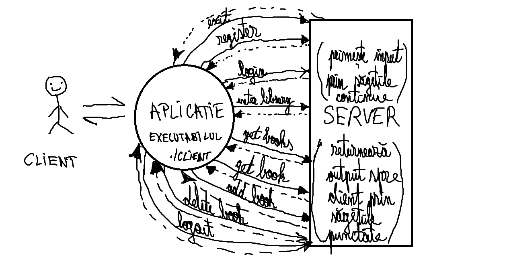

# Tema4 - implementare in C
## Continut arhiva
**Fisiere sursa:** _client.c_ (contine implementarea propriu-zisa a clientului), _request.c_ (contine implementarea request-urilor - GET, POST, DELETE), _request.h_(header cu functiile de request), _helpers.c_ (contine implementari pentru managementul erorilor si pentru interactiunea cu mesajele primite de la server), _helpers.h_, _buffer.c_(fisier din laboratorul 9), _buffer.h_(fisier din laboratorul 9).\
**Makefile** din laboratorul 9.\
**README.md**
## Ideea de implementare

Dupa cateva ore bune de acomodare cu cerinta temei am ajuns la ideea descrisa in schita urmatoare:\
\

## Interpretare diagrama
### **- Register/Login (POST requests)**
In diagrama de mai sus se pot observa comenzile pe care utilizatorul (omul) le transmite prin intermediul aplicatiei (./client) catre server.
Serverul proceseaza mesajele primite si transmite un mesaj in care se gaseste si un cod care poate reprezenta succes (mesajul a fost receptionat de server cu succes) - OK 200/201, altfel trimitandu-se mesaj de eroare.
In caz de succes pe langa acest cod serverul trimite si niste cookies pe care utilizatorul le poate transmite mai tarziu serverului cu alte request-uri (ex: GET). 
De asemenea, pentru a se putea inregistra/loga, clientul are nevoie de token-ul _"Bearer eijjkwuqioueu9182712093801293"_ in cadrul header-ului _Authorization_ din request.\
### **- Enter_library (GET requests)**
In momentul in care clientul incearca sa se conecteze la o biblioteca, serverul primeste aceasta informatie si ii trimite clientului printre header-ele date si un _token_ prin intermediul caruia se vor putea face viitoarele operatii din cadrul bibliotecii (get/add/delete book/books).
Fara acest _token_ (char access_library[300] declarat in _helpers.h_) restul operatiilor nu se vor mai putea realiza.\
### **- Get/Add/Delete (GET/POST/DELETE requests)**
Acestea sunt operatiile de baza din cadrul aplicatiei prin care se pot gestiona cartile asociate unui utilizator.
Pentru fiecare dintre acestea serverul verifica mai intai daca exista si header-ul cu token-ul primit de utilizator la intrarea in biblioteca.
In cazul in care acesta nu exista, atunci acesta va trimite un mesaj cu un cod de eroare care va fi receptat de client.\
### **- Logout (GET requests)**
In acest caz serverul este instiintat de utilizator ca se delogheaza, la o viitoare relogare fiind necesara din nou operatia de intrare in biblioteca pentru a putea face operatii cu cartile sale.
### **- Exit**
Pentru aceasta operatie serverul nu are nevoie sa fie instiintat, fiind o operatie la nivelul interactiunii dintre utilizator si aplicatie.

## Alegere biblioteca de parsare
Pentru parsarea content-urilor de tip JSON am folosit biblioteca de parsare JSON "#include<json-c/json.h>", iar pentru a putea utiliza biblioteca am folosit urmatoarea comanda _sudo apt install libjson-c-dev_ pe Linux.
Motive ale alegerii:
 - **Eficiență și Performanță** Bibliotecile de manipulare a JSON-ului, cum ar fi json-c/json.h, sunt optimizate pentru performanță și eficiență. Acestea sunt adesea scrise în limbaje de programare cu performanță ridicată și sunt supuse testelor extinse pentru a se asigura că sunt cât mai rapide și fiabile posibil.
 - **Fiabilitate** Bibliotecile deja existente sunt adesea folosite de mulți dezvoltatori și sunt testate în diverse medii și scenarii. Acest lucru poate crește încrederea în fiabilitatea lor în comparație cu propriul parser pe care l-ai putea scrie manual cum este cazul _parson.h_.
 - **Suport pentru Standardizare și Conformitate** Bibliotecile populare precum json-c/json.h respectă standardele JSON și sunt actualizate pentru a reflecta modificările sau îmbunătățirile aduse acestor standarde. Utilizarea acestor biblioteci asigură că aplicația este conformă cu standardele JSON și că beneficiază de orice îmbunătățiri sau corecții viitoare.
 - **Comunitate și Suport** Bibliotecile populare beneficiază adesea de o comunitate activă de utilizatori și dezvoltatori care pot oferi suport, îndrumare și soluții pentru problemele întâmpinate. În plus, aceste biblioteci sunt adesea documentate bine, ceea ce face mai ușor să înveți și să utilizezi funcționalitățile acestora. Un astfel de exemplu este si site-ul acesta in care se poate gasi documentatia acestei biblioteci pentru toate versiunile existente: https://json-c.github.io/json-c/json-c-0.16/doc/html/json__object_8h.html#ac6605fdafca20bd5d33c84f4f80a3bda